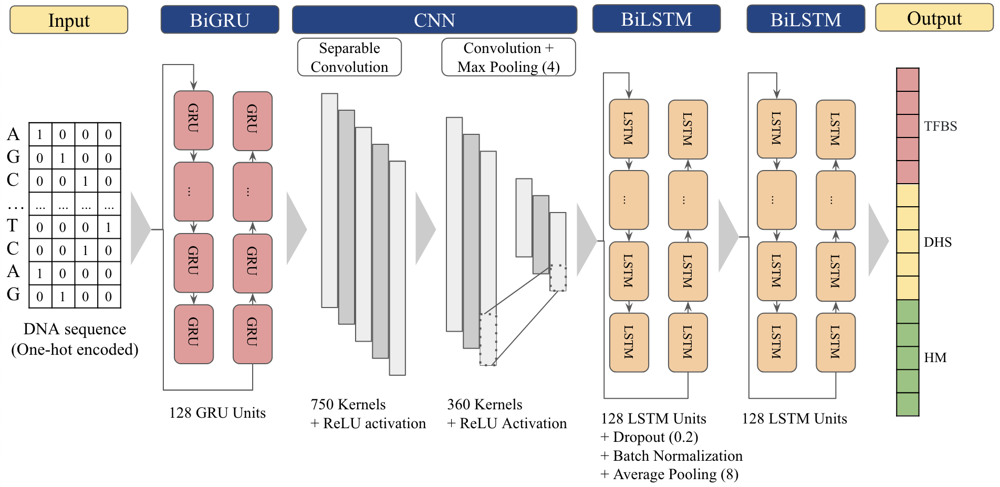

# ChromDL: A next generation deep learning hybrid neural network for the prediction of Transcription Factor Binding Sites and DNase-I Hypersensitive Sites in the hg19 genome
ChromDL is a hybrid neural network comprised of gated recurrent Units (GRUs), convolutional neural networks (CNNs), and long short-term memory units (LSTMs) for the prediction of TFBS and DHS using only DNA sequences as input.

Paper information: 

## Requirements
ChromDL was trained and run on the Biowulf HPC Cluster hosted by the National Institutes of Health. To do so, a .sif container file was created that included all required packages and can be found in the container definition file. The docker image was compiled from the Nvidia CUDA 11.0 toolkit including cuDNN version 8 for Ubuntu 18.04.

Included in this container (if preferred to install individually) are the following:
- Python (version 3.7.5)
- Tensorflow-GPU (version 2.4.0 from Google API Linux releases)
- H5py (version 2.10.0)
- Numpy (version 1.19.5)
- Scikit-learn (version 0.24.1)
- Scipy (version 1.6.0)
- Sklearn (version 0.0)

Also included in the container file for other file processing were:
- Pandas (version 1.2.1)
- Tensorflow Addons (version 0.12.1)
- Matplotlib (version 3.3.4)

## Usage
### Data
The ChIP-seq and DNase-seq data that this model was trained on can be found in DeepSEA's codebase, <http://deepsea.princeton.edu/media/code/deepsea_train_bundle.v0.9.tar.gz>.

The individual links for each of the 919 chromatin features labels can be found in `data/DeepSEA_data_sources.txt`, and the other data sources used in the experimentation and validation of the model can be found in `data/other_data_sources.txt`

### Container file
The previously mentioned container.sif used as the docker image for training and testing ChromDL can be downloaded from:

### Weight files
The fully trained ChromDL weight files can be downloaded from:

### Training ChromDL
`python ChromDL_train.py`
ChromDL_train.py will train the model for the 100 epochs using a batch size of 500 and save results to `train_out/ChromDL_train_out.txt`, and the weights from the training to `train_out/ChromDL_learned_weights`

Or, the user can input the number of epochs or change the batch size and run:
`python ChromDL_train.py <batch size> <number of epochs>`
ChromDL_train.py will train the model for the specified number of epochs using the inputted batch size and save results to `train_out/ChromDL_train_out.txt`, and the weights from the training to `train_out/ChromDL_learned_weights`

### Testing ChromDL

## Contact information
For help or issues using ChromDL, please contact Chris Hill (chrishil@umich.edu).
